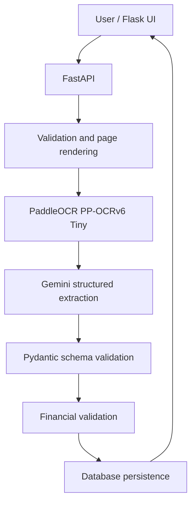

# Financial Document Intelligence

Financial Document Intelligence is a web application that uploads invoices and financial statements, extracts their contents, converts them into schema-validated JSON, runs financial consistency checks, and stores the processing result for later retrieval.

Supported document types:

- Invoice
- Balance sheet
- Profit and loss statement
- Cash-flow statement

## Application links

Replace the placeholder values below before publishing the repository.

| Resource | URL |
|---|---|
| Deployed application | `https://fin-doc-intel-ocr-1.onrender.com/` |
| Backend API | `https://fin-doc-intel-ocr.onrender.com/docs/api/v1` |
| Swagger UI | `https://fin-doc-intel-ocr-1.onrender.com/docs` |
| Public GitHub repository | `https://github.com/sivaprathish/fin_doc_intel_ocr` |
| Local application | `http://127.0.0.1:5000` |
| Local backend API | `http://127.0.0.1:8000/api/v1` |
| Local Swagger UI | `http://127.0.0.1:8000/docs` |

## Solution overview

The application separates document reading from financial interpretation:

1. FastAPI validates the uploaded PDF or image and limits processing to supported document types and page counts.
2. PDF pages are rendered as images when required.
3. PaddleOCR extracts text locally from every page.
4. Gemini receives the OCR text and returns document-specific structured JSON.
5. Pydantic validates the returned JSON against a strict invoice, balance-sheet, profit-and-loss, or cash-flow schema.
6. Deterministic Python rules check totals and accounting relationships.
7. The complete response is stored in the database and returned to the frontend.



## Technology stack

| Component | Technology | Reason for choice |
|---|---|---|
| Backend API | FastAPI | Typed request/response validation, async support, and automatic Swagger/OpenAPI documentation |
| Frontend | Flask, HTML, CSS, JavaScript | Lightweight upload and document-results dashboard |
| OCR | PaddleOCR 3.7 with PP-OCRv6 Tiny | Local OCR, no per-page OCR API charge, fast inference, and support for scanned PDFs and images |
| OCR runtime | PaddlePaddle 3.3.1 and PaddleX 3.7.2 | Runtime and model pipeline required by PaddleOCR |
| Structured extraction | Gemini Flash | Structured JSON output, long-context support, and a free/free-tier API option subject to Google quotas |
| Validation | Pydantic 2 | Strict schemas and clear model-output validation errors |
| Persistence | SQLAlchemy with SQLite locally | Simple local setup while preserving a migration path to PostgreSQL |
| Testing | pytest / unittest | Automated service and API behavior checks |
| Dependency management | uv | Fast, reproducible Python dependency installation and locking |

## Project structure

```text
financial-document-intelligence/
├── backend/
│   ├── app/
│   │   ├── main.py
│   │   ├── core/
│   │   ├── models/
│   │   ├── schemas/
│   │   └── services/
│   └── tests/
├── frontend/
│   ├── app.py
│   ├── static/
│   ├── templates/
│   └── tests/
├── .env.example
├── pyproject.toml
└── README.md
```

## Local setup

### Prerequisites

- Python 3.11 or 3.12
- `uv`
- A Gemini API key
- Windows, Linux, or macOS with sufficient disk space for PaddleOCR and its cached models

### 1. Clone the repository

```bash
git clone <PUBLIC_GITHUB_REPOSITORY_URL>
cd financial-document-intelligence
```

### 2. Install dependencies

If the project already contains `pyproject.toml` and `uv.lock`:

```bash
uv sync
```

If dependencies are maintained in a requirements file:

```bash
uv add -r requirements.txt
```

### 3. Configure the environment

Copy `.env.example` to `.env`:

```powershell
Copy-Item .env.example .env
```

Linux/macOS:

```bash
cp .env.example .env
```

Add your own `GEMINI_API_KEY` to `.env`. Never commit `.env`.

### 4. Start the backend

PowerShell:

```powershell
$env:PYTHONPATH = "backend"
uv run uvicorn app.main:app --reload --port 8000 --log-level info
```

Linux/macOS:

```bash
PYTHONPATH=backend uv run uvicorn app.main:app --reload --port 8000 --log-level info
```

Verify:

- Health: `http://127.0.0.1:8000/api/v1/health`
- Swagger: `http://127.0.0.1:8000/docs`

The first OCR request can take longer because PaddleOCR downloads and initializes its model files. Later requests use the cached models.

### 5. Start the frontend

Open another terminal:

```bash
uv run python frontend/app.py
```

Open `http://127.0.0.1:5000`.

### 6. Run tests

```bash
uv run pytest
uv run python -m unittest discover -s frontend/tests
```

## Environment variables

The repository includes `.env.example`. Important variables are summarized below.

| Variable | Purpose | Example |
|---|---|---|
| `GEMINI_API_KEY` | Gemini authentication secret | Set locally; never commit |
| `GEMINI_MODEL` | Model used for structured extraction | `gemini-3.6-flash` |
| `GEMINI_TIMEOUT_SECONDS` | Gemini request timeout | `240` |
| `GEMINI_MAX_ATTEMPTS` | Controlled extraction attempts | `2` |
| `PADDLEOCR_LANGUAGE` | OCR language configuration | `en` |
| `PADDLEOCR_DEVICE` | Paddle inference device | `cpu` |
| `PADDLEOCR_DET_MODEL` | Text-detection model | `PP-OCRv6_tiny_det` |
| `PADDLEOCR_REC_MODEL` | Text-recognition model | `PP-OCRv6_tiny_rec` |
| `DATABASE_URL` | SQLAlchemy database connection | `sqlite:///./documents.db` |
| `BACKEND_API_URL` | API URL used by Flask | `http://127.0.0.1:8000/api/v1` |
| `BACKEND_TIMEOUT_SECONDS` | Flask-to-FastAPI upload timeout | `300` |
| `FINANCIAL_TOLERANCE` | Absolute tolerance used by numerical checks | `0.01` |
| `LOG_LEVEL` | Application logging level | `INFO` |

If your settings class uses different names, keep `.env.example` synchronized with those exact field names.

## API usage

### Process a document

```http
POST /api/v1/documents/process
Content-Type: multipart/form-data
```

Valid `document_type` values:

```text
invoice
balance_sheet
profit_and_loss
cash_flow_statement
```

PowerShell:

```powershell
curl.exe -X POST `
  "http://127.0.0.1:8000/api/v1/documents/process" `
  -H "accept: application/json" `
  -F "document_type=cash_flow_statement" `
  -F "file=@C:\documents\cash-flow.pdf;type=application/pdf"
```

Linux/macOS:

```bash
curl -X POST \
  "http://127.0.0.1:8000/api/v1/documents/process" \
  -H "accept: application/json" \
  -F "document_type=cash_flow_statement" \
  -F "file=@./cash-flow.pdf;type=application/pdf"
```

### Get the latest result by document name

URL-encode filenames containing spaces.

```bash
curl "http://127.0.0.1:8000/api/v1/documents/Consolidated%20Cash%20Flow%202017.pdf"
```

### List documents for the dashboard

```bash
curl "http://127.0.0.1:8000/api/v1/documents?offset=0&limit=25"
```

Example list item:

```json
{
  "id": 1,
  "document_name": "cash-flow.pdf",
  "document_type": "cash_flow_statement",
  "processing_status": "PASS",
  "created_at": "2026-09-12T05:00:00Z"
}
```

## OCR and LLM processing

### PaddleOCR

The application uses PP-OCRv6 Tiny detection and recognition models. OCR runs locally and returns ordered text entries for each rendered page. The extracted text preserves headings, reporting periods, row labels, printed numbers, and negative values represented with parentheses.

PaddleOCR is open source and does not require a paid OCR API. Model files are downloaded on first use and cached in the user's PaddleX model directory.

### Gemini Flash

Gemini converts OCR text into one of four strict document-specific response schemas. The model is instructed to:

- return JSON only;
- preserve every reporting period;
- preserve printed raw values;
- convert parenthesized numbers to negative numeric values;
- return `null` instead of inventing unreadable values;
- include every visible financial row.

Gemini offers a free/free-tier allowance where available, but quotas and model availability depend on the Google account and region. HTTP `429` means the active API project has reached a quota or rate limit. API keys are tied to projects; changing the key only changes quota when the new key belongs to a different project with available quota.

Cash-flow statements are processed page by page and merged because multi-page structured responses can exceed provider connection or output limits.

## Extracted-data model

The normalized response contains:

- `document_fields`: invoice or statement metadata;
- `periods`: unique reporting periods in displayed order;
- `invoice_line_items`: invoice products and services;
- `financial_line_items`: balance-sheet, P&L, and cash-flow rows;
- `additional_tables`: optional supplementary tables;
- `warnings`: extraction-quality notes.

Each financial line item stores normalized numeric values and the original printed values:

```json
{
  "label": "Net cash from operating activities",
  "category": "OPERATING_ACTIVITIES",
  "values": {
    "31-Mar-17": 172815931.0,
    "31-Mar-16": -344353663.0
  },
  "raw_values": {
    "31-Mar-17": "172,815,931",
    "31-Mar-16": "(344,353,663)"
  }
}
```

## Financial validation

Validation is deterministic; the LLM does not decide whether a document passes.

| Document type | Representative validation rules |
|---|---|
| Invoice | `line amount = quantity × unit price`; `subtotal = sum(line amounts)`; `total = subtotal + tax - discount`; `change = cash paid - total` |
| Balance sheet | `total assets = total capital and liabilities`; asset-component sum; capital/liability-component sum |
| Profit and loss | income total; expenditure total; profit calculation; comparative-period consistency where source values exist |
| Cash flow | net change equals operating + investing + financing cash flow; closing cash equals opening cash + net change |

The default absolute tolerance is:

```text
|calculated value - reported value| <= 0.01
```

Configure it with `FINANCIAL_TOLERANCE`. A check returns:

- `PASS` when the variance is within tolerance;
- `FAIL` when all required values exist and the variance exceeds tolerance;
- `NOT_APPLICABLE` when one or more required source values are unavailable.

`NOT_APPLICABLE` must not be interpreted as a successful accounting check.

## Confidence scoring

The current response schema does not implement a calibrated confidence score. Reliability is represented through:

- OCR and schema-validation failures;
- evidence/raw values where captured;
- extraction warnings;
- deterministic financial-check results.

A production version should add field-level OCR confidence, extraction confidence, and a documented calibration dataset before presenting a single overall confidence percentage.

## Database and persistence

Local development uses SQLite through SQLAlchemy. Each completed processing attempt stores document metadata and the structured response needed by the list and document-detail APIs, including:

- original document name and selected type;
- processing status and creation time;
- file-validation result;
- extracted JSON;
- financial-validation result;
- processing metadata such as page count, model and duration.

`GET /api/v1/documents` returns paginated summary records. `GET /api/v1/documents/{document_name}` returns the newest stored record for that filename.

Uploaded financial files should not be stored unless this is explicitly required. If originals are retained in production, place them in encrypted object storage and save only the object identifier in the relational database.

## Known limitations

- Processing is limited to the configured supported formats and a maximum of three pages.
- OCR quality depends on image resolution, orientation, contrast, language, fonts and table complexity.
- PP-OCRv6 Tiny is faster and smaller than larger layout-aware models but may lose column alignment in dense statements.
- Gemini latency and availability depend on the selected model, account quota and provider connectivity.
- Free-tier Gemini requests can return `429`, and long requests can time out.
- Multi-page extraction and merging can duplicate repeated headers or totals without explicit deduplication.
- Strict schemas reject incomplete or structurally invalid model responses.
- Numerical validation cannot run when required fields are missing; those checks return `NOT_APPLICABLE`.
- A filename is not a globally unique document identifier.
- SQLite is intended for local development and low write concurrency.
- OCR output and financial data can be sensitive and should not be logged in production.


## AI coding assistants

Github Copilot and chatgpt was used as a coding assistant for:

- initial FastAPI, service and schema scaffolding;
- PaddleOCR and Gemini integration guidance;
- document-specific structured-output schemas;
- debugging provider errors, timeouts and validation failures;
- automated-test suggestions;
- API documentation and README preparation.


